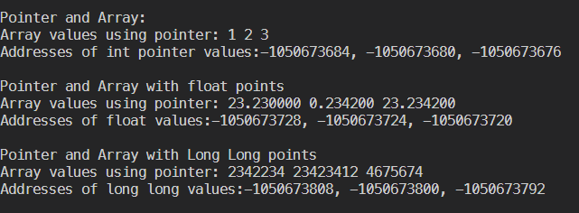
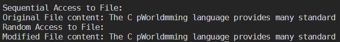

# Pointers in C

## In Array

- In array, first element's location is carried by the name of the array
- `*ptr = array_;` will have the location of the first element of the array

- `*ptr, *(ptr+1), *(ptr+2)` will give access to elements of the array one after another

- Depends on the type of data, +1, +2 can hop 4 to 8 bytes depending on the data type, as integer, or long long



- In this example, the bytes hopped are 8 for long long, but 8 for integer pointers.

## In Struct

- Use of arrow function
  `ptr->name, ptr->age` is used.

## Pointers and Functions

- the variables need not match
- `func(&x)` can be passed while calling a function
  - `void func(*p)` is how the function is defined

# Struct and Union

Union stores different data types in the same memory location

- only one member can contain a value at any given time

- efficient way of using same memory location for multiple purposes!

* size of struct = greater than or equal to the sum of sizes of its members
* size of union = size of the largest member

### Union

- altering value of any member will alter the other member values as well

# File I/O

- use of **fopen, fprintf and fclose**
- reading the files, using **fgets**
  `fgets(variable, no. of chars, file_opened);`

## Sequential and Random Access to Files

- `fseek, SEEK_SET`
- `fseek(file, byte_position, SEEK_SET)`

  - can be `SEEK_CUR`: places file pointer at given poistion
  - `SEEK_END` : places file pointer at the end of the file
  - example can be:

  ```
    fseek(file, 7, SEEK_SET);
    fprintf(file, "World");
    fclose(file);
  ```

  - replaces the letters from 7th by 'world' and rest remains the same
    
